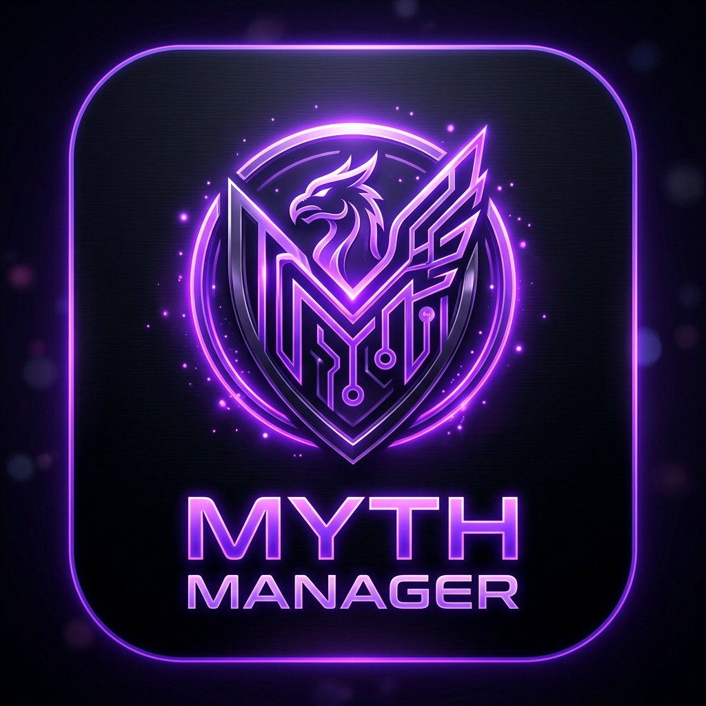

Copyright (C) 2026 Berkay Küçükbekar. All Rights Reserved. (Tüm Hakları Saklıdır.)
This software and its source code are proprietary. Unauthorized copying, 
modification, distribution, or creation of derivative works via any medium 
is strictly prohibited.

# 🎮 Myth-Manager

<p align="center">
  
</p>

<p align="center">
  
  
  
</p>

<p align="center">
  <a href="https://www.youtube.com/@wenshertmx">
    
  </a>
  <a href="https://discord.com/invite/SnRpn3ADNF">
    
  </a>
</p>

[🇹🇷 Türkçe](#-türkçe) | [🇬🇧 English](#-english)


---

## 🇹🇷 Türkçe

> **wenshert** tarafından geliştirilen, oyun kütüphanenizi yönetmenizi, performans artırıcı grafik modlarını kurmanızı ve oyunlarınızı sıkıştırarak disk alanından tasarruf etmenizi sağlayan hepsi bir arada Windows masaüstü yardımcısı.

### 🌟 Öne Çıkan Özellikler

Myth-Manager, modern oyuncuların ihtiyaç duyduğu mod yönetimi, disk alanı tasarrufu ve oyun keşfi gibi birçok güçlü aracı tek bir çatı altında birleştirir:

*   🔍 **Gelişmiş Oyun Tarama:** **Steam**, **Epic Games**, **GOG Galaxy**, **Xbox**, **EA App** ve **Ubisoft Connect** platformlarındaki oyunları otomatik olarak algılar. Ayrıca Windows Kayıt Defteri (Registry) ve manuel tanımlanan klasörleri de tarayabilir.
*   🖼️ **Otomatik Kapak Görseli:** Bulunan oyunlar için **SteamGrid DB API** kullanarak otomatik olarak kapak görsellerini indirir ve şık bir oyun kütüphanesi oluşturur.
*   ⚡ **Tek Tıkla Grafik Modu Kurulumu:** Oyunlarınıza DLSS Enabler, OptiScaler, OptiBuilder ve Streamline gibi performans artıran ve kare oluşturma (Frame Generation) sağlayan modları güvenli bir şekilde kurar ve yönetir.
*   🧙 **İnteraktif Kurulum Sihirbazları:** DLSS Enabler, OptiScaler ve OptiBuilder için oyununuza en uygun enjeksiyon türünü ve DLL yapılandırmasını (DXGI, version.dll vb.) adım adım belirleyen akıllı kurulum sihirbazı (Wizard) desteği.
*   🛠️ **OptiBuilder Entegrasyonu:** Özelleştirilmiş OptiBuilder sürümlerini doğrudan GitHub üzerinden çekin, interaktif terminal sihirbazı ile oyunuza özgü mod derlemelerini kolayca kurun ve yönetin.
*   🔧 **Otomatik DLSS Enabler Kurulumu:** DLSS Enabler'ı seçilen oyuna birkaç tıklamayla otomatik olarak indirir ve kurar.
*   📝 **Yapılandırma Dosyası Düzenleyici:** `OptiScaler.ini` ve `dlss-enabler.ini` gibi `.ini` yapılandırma dosyalarını doğrudan program üzerinden kolayca düzenleyin. *(Yakında: Hazır Ayar (Preset) sistemi!)*
*   🎁 **Ücretsiz Oyunlar & Keyler:** **GamePower Free API** entegrasyonu sayesinde anlık ücretsiz oyunları ve dağıtılan keyleri doğrudan uygulama içinden takip edin.
*   🧰 **Araçlar:** Oyun deneyiminizi iyileştirecek faydalı uygulamaların derlenmiş listesine tek bir yerden ulaşın.
*   🎮 **Geliştiriciye Göre Desteklenen Oyunlar:** Hangi oyunların DLSS Enabler veya OptiScaler ile desteklendiğini geliştirici bazında filtreleyerek görüntüleyin.
*   💾 **Akıllı Oyun Sıkıştırma:** Windows'un yerleşik sıkıştırma algoritmalarını (**XPRESS 4K/8K/16K ve LZX**) kullanarak oyun klasörlerinizi sıkıştırır. Oyunlar oynanabilir kalırken diskte devasa alan açılır!
*   📺 **YouTube Entegrasyonu:** Grafik modlarının kurulum rehberlerini ve en yeni oyun videolarını doğrudan uygulama içerisindeki "Videolar" sekmesinden izlemenizi sağlar.
*   🎨 **Premium Arayüz & Karanlık Tema:** Kullanıcı dostu, modern animasyonlara sahip, `Plus Jakarta Sans` yazı tipiyle tasarlanmış göz yormayan karanlık tema.

---

### 🛠️ Desteklenen Grafik Modları

Myth-Manager, günümüzün en popüler upscaler ve kare oluşturma modlarının yönetimini basitleştirir:

| Mod Adı | Açıklama | Myth-Manager Entegrasyonu |
| :--- | :--- | :--- |
| **DLSS Enabler** | NVIDIA RTX olmayan ekran kartlarında dahi Multi Frame Generation (Kare Oluşturma) özelliğini aktif hale getirir. | Yerel sürümleri listeleme, otomatik ve manuel kurulum, interaktif sihirbaz (Wizard), güvenli kaldırma ve enjeksiyon kontrolü. |
| **OptiScaler** | DLSS/FSR/XeSS arasında köprü kuran açık kaynaklı ölçeklendirme aracı. | GitHub Releases API üzerinden en güncel sürümleri çekme, otomatik `.7z` indirme, ayıklama, akıllı sihirbaz ile kurma. |
| **OptiBuilder** | OptiScaler ve mod bileşenlerini özelleştirilmiş derlemelerle oluşturan ve yöneten gelişmiş araç. | GitHub üzerinden en güncel sürümleri çekme, otomatik/manuel kurulum, interaktif terminal sihirbazı ve kaldırma desteği. |
| **Streamline** | NVIDIA'nın Streamline SDK kütüphanelerini yönetir. | Derinlemesine arama (BFS) ile `sl.*.dll` konumunu bulma, güncellemelere karşı yedekleme ve hash doğrulamalı geri yükleme. |
| **OptiPatcher** | OptiScaler için ek uyumluluk ve stabilite yamaları sağlar. | GitHub üzerinden otomatik sürüm kontrolü ve kurulum desteği. |
| **FSR4 Dosyaları** | FSR4 mod kütüphaneleri için gerekli dosyaları barındırır. | Harici indirme sunucusundan son sürüm dosyalarını çekebilme imkanı. |

---

### 🗜️ Disk Alanından Tasarruf: Akıllı Sıkıştırma

Uygulamanın **Sıkıştır** sekmesi altında, Windows'un Compact OS teknolojisini kullanarak klasörleri sıkıştırabilirsiniz:

*   **XPRESS 4K:** Hızlı sıkıştırma, düşük işlemci kullanımı (Ortalama %21 sıkıştırma oranı).
*   **XPRESS 8K / 16K:** Dengeli ve yüksek sıkıştırma oranları.
*   **LZX:** Maksimum sıkıştırma oranı (Yüksek işlemci gücü gerektirir, arşiv veya büyük oyunlar için idealdir).

---

### 🚀 Geliştiriciler İçin Kurulum

Projeyi yerel bilgisayarınızda çalıştırmak veya geliştirmek için aşağıdaki adımları takip edebilirsiniz:

#### Gereksinimler
*   [Node.js](https://nodejs.org/) (v18 veya daha yeni bir sürüm önerilir)
*   Windows İşletim Sistemi (Modların ve sıkıştırma araçlarının çalışabilmesi için gereklidir)

#### Adımlar
1.  **Projeyi Klonlayın:**
    ```bash
    git clone https://github.com/wenshert/myth-manager.git
    cd myth-manager
    ```

2.  **Bağımlılıkları Yükleyin:**
    ```bash
    npm install
    ```

3.  **Uygulamayı Geliştirici Modunda Başlatın:**
    ```bash
    npm start
    ```

4.  **Uygulamayı Derleyin (Yerel Build):**
    ```bash
    npm run build:local
    ```
    *Bu komut, Windows (`x64`) için yerel kurulabilir bir `.exe` yükleyicisi (NSIS) oluşturur ve `dist/` klasörüne kaydeder. (V8 Bytecode derlemesiyle birlikte paketlemek için `npm run build:compile` kullanabilirsiniz).*

---

### 📂 Proje Yapısı

Uygulamanın temel modülleri ve görevleri şu şekildedir:

```text
├── main.js                 # Electron ana süreci (bootstrap)
├── preload.js              # Güvenli IPC köprüsü (Main ↔ Renderer)
├── index.html              # Kullanıcı arayüzü HTML yapısı
├── styles.css              # Premium modern CSS tasarımı
├── src/                    # Uygulama kaynak kodları
│   └── main/
│       ├── index.js        # Uygulama yaşam döngüsü & açılış mantığı
│       ├── config.js       # Yapılandırma, oyun listesi ve yollar
│       ├── ipc.js          # IPC iletişim kanalları (Main handlers)
│       ├── license.js      # HWID tabanlı lisans doğrulama
│       ├── scanner.js      # Çoklu platform oyun tarayıcısı
│       ├── discord.js      # Discord Rich Presence modülü
│       ├── updater.js      # Otomatik güncelleme yöneticisi
│       ├── utils.js        # Dosya hash, sürüm okuma ve API araçları
│       ├── window.js       # BrowserWindow yönetim modülü
│       └── mods/           # Mod yükleme, sihirbaz ve sıkıştırma mantıkları
│           ├── dlssEnabler.js      # DLSS Enabler yönetimi
│           ├── dlssWizard.js       # DLSS Enabler akıllı kurulum sihirbazı
│           ├── optiScaler.js       # OptiScaler otomatik indirici & kurucu
│           ├── optiWizard.js       # OptiScaler interaktif kurulum sihirbazı
│           ├── optiBuilder.js      # OptiBuilder yönetimi ve indiricisi
│           ├── optiBuilderWizard.js # OptiBuilder terminal/sihirbaz arayüzü
│           ├── streamline.js       # Streamline yedekleme ve güncelleme
│           ├── uninstaller.js      # Güvenli mod kaldırma modülü
│           └── compressor.js       # Sıkıştırma motoru
└── package.json            # Proje bağımlılıkları ve scriptler
```

---

### 🔑 Lisans ve Geri Bildirim

**Myth-Manager - Kullanıcı Lisans Sözleşmesi**

Bu yazılım "olduğu gibi" sunulmaktadır. Yazılımın kullanımıyla ilgili tüm riskler kullanıcıya aittir. 

1. **Lisans Hakkı:** Bu yazılım ve kaynak kodları tescillidir (Proprietary). Berkay Küçükbekar'ın yazılı izni olmaksızın kopyalanması, değiştirilmesi, dağıtılması veya herhangi bir ortamda türetilmiş eserler oluşturulması kesinlikle yasaktır. Tüm hakları saklıdır.
2. **Sorumluluk Reddi:** Geliştirici, bu yazılımın kullanımından doğabilecek herhangi bir veri kaybı veya sistem hasarından sorumlu tutulamaz.
3. **Değişiklikler:** Geliştirici, yazılımın özelliklerini veya bu sözleşmeyi dilediği zaman güncelleme hakkını saklı tutar.

Uygulamayı kurarak bu şartları kabul etmiş sayılırsınız.

---

Karşılaştığınız hataları veya önerilerinizi **Issues** sekmesinden bildirebilirsiniz.

---

## 🇬🇧 English

> An all-in-one Windows desktop companion developed by **wenshert** that lets you manage your game library, install performance-boosting graphics mods, and save disk space by compressing your games.

### 🌟 Key Features

Myth-Manager brings together many powerful tools that modern gamers need — mod management, disk space savings, and game discovery — all under one roof:

*   🔍 **Advanced Game Scanning:** Automatically detects games from **Steam**, **Epic Games**, **GOG Galaxy**, **Xbox**, **EA App**, and **Ubisoft Connect**. Can also scan the Windows Registry and manually defined folders.
*   🖼️ **Automatic Cover Art:** Downloads cover images automatically for found games using the **SteamGridDB API**, creating a sleek game library.
*   ⚡ **One-Click Graphics Mod Installation:** Safely installs and manages performance-enhancing mods with Frame Generation support — including DLSS Enabler, OptiScaler, OptiBuilder, and Streamline.
*   🧙 **Interactive Installation Wizards:** Smart step-by-step installation wizards for DLSS Enabler, OptiScaler, and OptiBuilder that guide you to select the best injection method and DLL configuration (DXGI, version.dll, etc.) for your specific game.
*   🛠️ **OptiBuilder Integration:** Fetch customized OptiBuilder releases directly via GitHub, and easily install or manage custom mod builds using an interactive terminal wizard.
*   🔧 **Automated DLSS Enabler Installation:** Automatically downloads and installs DLSS Enabler to your selected game in just a few clicks.
*   📝 **Config File Editor:** Edit `.ini` configuration files such as `OptiScaler.ini` and `dlss-enabler.ini` directly through the program. *(Coming soon: Preset system!)*
*   🎁 **Free Games & Keys:** Track currently free games and distributed keys in real time via the integrated **GamePower Free API** — without ever leaving the app.
*   🧰 **Tools:** A curated list of useful applications to enhance your gaming experience, all accessible from one place.
*   🎮 **Supported Games by Developer:** Browse which games support DLSS Enabler or OptiScaler, filterable by developer.
*   💾 **Smart Game Compression:** Compresses your game folders using Windows' built-in compression algorithms (**XPRESS 4K/8K/16K and LZX**). Games remain fully playable while freeing up massive disk space!
*   📺 **YouTube Integration:** Watch installation guides for graphics mods and the latest game videos directly from the "Videos" tab inside the app.
*   🎨 **Premium UI & Dark Theme:** A user-friendly, modern dark theme with smooth animations, crafted with the `Plus Jakarta Sans` typeface.

---

### 🛠️ Supported Graphics Mods

Myth-Manager simplifies the management of today's most popular upscaler and frame generation mods:

| Mod Name | Description | Myth-Manager Integration |
| :--- | :--- | :--- |
| **DLSS Enabler** | Enables Multi Frame Generation even on non-NVIDIA RTX graphics cards. | List local versions, automated & manual install, interactive wizard, safe uninstall, and injection control. |
| **OptiScaler** | An open-source scaling bridge between DLSS, FSR, and XeSS. | Fetches latest releases via GitHub Releases API, with automatic `.7z` download, extraction, smart wizard install. |
| **OptiBuilder** | Advanced tool that builds and manages OptiScaler and mod components with customized builds. | Fetches latest versions via GitHub, automated/manual install, interactive terminal wizard, and safe removal. |
| **Streamline** | Manages NVIDIA's Streamline SDK libraries. | Locates `sl.*.dll` with deep BFS search, backs up before updates, and restores with hash verification. |
| **OptiPatcher** | Provides additional compatibility and stability patches for OptiScaler. | Automatic version check and installation support via GitHub. |
| **FSR4 Files** | Hosts the necessary files for FSR4 mod libraries. | Fetches the latest files from an external download server. |

---

### 🗜️ Save Disk Space: Smart Compression

Under the **Compress** tab, you can compress folders using Windows' Compact OS technology:

*   **XPRESS 4K:** Fast compression, low CPU usage (average ~21% compression ratio).
*   **XPRESS 8K / 16K:** Balanced and high compression ratios.
*   **LZX:** Maximum compression ratio (requires high CPU power — ideal for archives or large games).

---

### 🚀 Developer Setup

To run or contribute to the project on your local machine, follow these steps:

#### Requirements
*   [Node.js](https://nodejs.org/) (v18 or newer recommended)
*   Windows OS (required for mods and compression tools to function)

#### Steps
1.  **Clone the Repository:**
    ```bash
    git clone https://github.com/wenshert/myth-manager.git
    cd myth-manager
    ```

2.  **Install Dependencies:**
    ```bash
    npm install
    ```

3.  **Start in Developer Mode:**
    ```bash
    npm start
    ```

4.  **Build for Production (Local Build):**
    ```bash
    npm run build:local
    ```
    *This command creates a local installable `.exe` (NSIS) for Windows (`x64`) and saves it to the `dist/` folder. (You can also use `npm run build:compile` to bundle with V8 Bytecode compilation).*

---

### 📂 Project Structure

The core modules of the application and their responsibilities:

```text
├── main.js                 # Electron main process (bootstrap)
├── preload.js              # Secure IPC bridge (Main ↔ Renderer)
├── index.html              # UI HTML structure
├── styles.css              # Premium modern CSS design
├── src/                    # Application source code
│   └── main/
│       ├── index.js        # Application lifecycle & bootstrap logic
│       ├── config.js       # Configuration, game list, and paths
│       ├── ipc.js          # IPC communication channels (Main handlers)
│       ├── license.js      # HWID-based license verification
│       ├── scanner.js      # Multi-platform game scanner
│       ├── discord.js      # Discord Rich Presence module
│       ├── updater.js      # Auto-updater manager
│       ├── utils.js        # File hash, version reading, and API utilities
│       ├── window.js       # BrowserWindow management module
│       └── mods/           # Mod installation, wizards, and compression logic
│           ├── dlssEnabler.js      # DLSS Enabler manager
│           ├── dlssWizard.js       # DLSS Enabler smart installation wizard
│           ├── optiScaler.js       # OptiScaler auto-downloader & installer
│           ├── optiWizard.js       # OptiScaler interactive wizard
│           ├── optiBuilder.js      # OptiBuilder manager & downloader
│           ├── optiBuilderWizard.js # OptiBuilder terminal/wizard UI handler
│           ├── streamline.js       # Streamline backup and update system
│           ├── uninstaller.js      # Safe mod removal module
│           └── compressor.js       # Compression engine
└── package.json            # Project dependencies and scripts
```

---

### 🔑 License & Feedback

**Myth-Manager - User License Agreement**

This software is provided "as is", without warranty of any kind. Use at your own risk.

1. **License Rights:** This software and its source code are proprietary. Unauthorized copying, modification, distribution, or creation of derivative works via any medium is strictly prohibited. Copyright (C) 2026 Berkay Küçükbekar. All Rights Reserved.
2. **Disclaimer:** The developer is not responsible for any data loss or system damage arising from the use of this software.
3. **Modifications:** The developer reserves the right to update features or this agreement at any time.

By installing this software, you agree to these terms.

---

You can report bugs or suggestions via the **Issues** tab.

---
<p align="center">Made with ❤️ by <a href="https://github.com/wenshert">wenshert</a></p>
